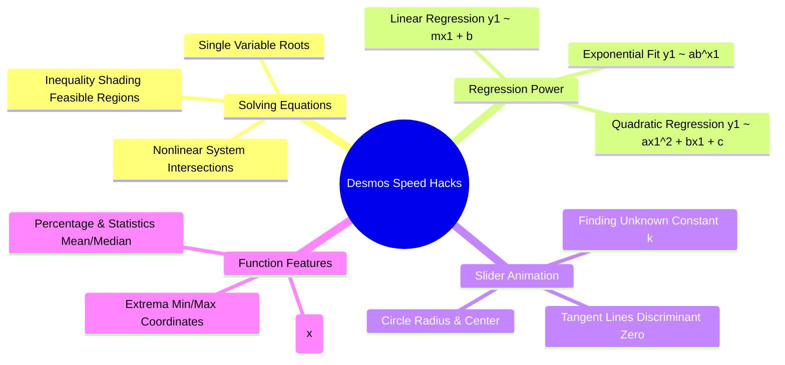

# 📐 The Ultimate Digital SAT Desmos Calculator Mastery Guide & Speed Hacks

## 📌 Executive Overview
On the Digital SAT, the embedded **Desmos Graphing Calculator** is available for **100% of the Math section**. Mastering Desmos transforms 3-minute complex algebraic problems into 15-second visual clicks. This student toolkit details the **15 most essential Desmos hacks** with step-by-step keystrokes and Bluebook-calibrated examples.

---

## 🚀 The 15 Essential Desmos Speed Hacks

---

### 1. The Single-Variable Root Solver
- **The Problem**: Solving complex quadratic or radical equations like $3(x - 4)^2 - 18 = 7x + 5$.
- **Desmos Hack**:
  1. Type the entire equation directly into Line 1: `3(x - 4)^2 - 18 = 7x + 5`.
  2. Desmos will draw vertical gray lines through every real solution.
  3. Click on the $x$-intercept of the vertical lines to read the exact solutions instantly.

---

### 2. The Slider Hack for Unknown Constants ($k, a, b$)
- **The Problem**: *"For what value of $k$ does $2x^2 - 8x + k = 0$ have exactly one solution?"*
- **Desmos Hack**:
  1. Type `y = 2x^2 - 8x + k` into Line 1.
  2. Click **"add slider: k"**.
  3. Slide or type values for $k$ until the parabola's vertex is exactly tangent to the $x$-axis ($y = 0$).
  4. The slider reads $k = 8$.

---

### 3. System of Equations Intersection Finder
- **The Problem**: Finding intersection points $(x, y)$ of a linear line and a circle or parabola.
- **Desmos Hack**:
  1. Line 1: `(x - 3)^2 + (y + 2)^2 = 25`
  2. Line 2: `y = 2x - 1`
  3. Click directly on the gray intersection dots on the graph. Desmos locks onto coordinates like $(3, 5)$ and $(-1, -3)$.

---

### 4. Table Regression Hack: Finding Unknown Quadratic Equations
- **The Problem**: *"A parabola passes through $(-2, 12)$, $(1, -3)$, and $(4, 18)$. What is the equation in standard form?"*
- **Desmos Hack**:
  1. Click the `+` icon $\rightarrow$ select **Table**.
  2. Enter the $x_1$ and $y_1$ coordinates into the table.
  3. In Line 2, type the regression command:
     $$y_1 \sim ax_1^2 + bx_1 + c$$
  4. Desmos instantly outputs the exact values for parameters $a, b, c$ and $R^2 = 1$.

---

### 5. Linear Equation from Two Points (Instant Slope & Intercept)
- **The Problem**: *"Find the linear equation passing through $(-5, 14)$ and $(7, -10)$."*
- **Desmos Hack**:
  1. Add a table with points $(-5, 14)$ and $(7, -10)$.
  2. Line 2: `y1 ~ mx1 + b`
  3. Desmos gives $m = -2$ and $b = 4 \implies y = -2x + 4$.

---

### 6. Circle Equation Standard Form Extractor
- **The Problem**: Find the radius and center of $x^2 + y^2 - 8x + 12y - 12 = 0$.
- **Desmos Hack**:
  1. Type the full expanded circle equation directly into Desmos.
  2. Click the leftmost point $(-2, -6)$ and rightmost point $(10, -6)$.
  3. $\text{Diameter} = 10 - (-2) = 12 \implies \text{Radius } r = 6$.
  4. The center $x$-coordinate is the midpoint: $\frac{10 + (-2)}{2} = 4$; center $y = -6 \implies (4, -6)$.

---

### 7. Infinite Solutions vs No Solutions in Linear Systems
- **Infinite Solutions**: Graph both equations with sliders. The lines must overlap completely across every point.
- **No Solution**: The lines must be parallel (equal slope, non-overlapping).

---

### 8. Evaluating Complex Function Compositions $f(g(x))$
- **Desmos Hack**:
  1. Line 1: `f(x) = 3x^2 - 5x + 2`
  2. Line 2: `g(x) = 2x - 7`
  3. Line 3: `f(g(4))` $\rightarrow$ Desmos immediately displays the numerical output `f(g(4)) = 10`.

---

### 9. Instant Removable Discontinuity (Hole) Finder
- **The Problem**: *"At what $x$-value does $g(x) = \frac{x^2 - 9}{x - 3}$ have a hole?"*
- **Desmos Hack**:
  1. Type `y = (x^2 - 9)/(x - 3)`.
  2. Click and hold on the line, dragging your cursor to $x = 3$.
  3. Desmos displays a hollow circle with `(3, undefined)`, proving the removable hole is at $x = 3$.

---

### 10. Percentage & Exponential Modeling Regression
- **The Problem**: *"A population begins at 400 and grows to 1,600 after 6 years. Find the exponential model $y = a \cdot b^x$."*
- **Desmos Hack**:
  1. Table: $(0, 400)$ and $(6, 1600)$.
  2. Line 2: `y1 ~ a * b^(x1)`
  3. Desmos outputs $a = 400$, $b \approx 1.2599$.

---

### 11. Trigonometric Mode Toggle (Radians vs. Degrees)
- **Desmos Hack**:
  - Click the **Wrench icon (Settings)** in the top right.
  - At the very bottom, toggle between **Radians** and **Degrees**.
  - *Default is Radians!* Always check mode when calculating $\sin(30^\circ)$ vs $\sin(\frac{\pi}{6})$.

---

### 12. Instant Statistics: Mean, Median, Standard Deviation
- **Desmos Hack**:
  - Define a list in Line 1: `L = [12, 15, 18, 22, 25, 29, 35]`
  - Line 2: `mean(L)` $\rightarrow$ gives exact average.
  - Line 3: `median(L)` $\rightarrow$ gives exact median.
  - Line 4: `stdev(L)` $\rightarrow$ gives sample standard deviation.
  - Line 5: `total(L)` $\rightarrow$ gives sum of all values.

---

### 13. Absolute Value Inequalities Feasible Regions
- **Desmos Hack**:
  - Type `|2x - 5| <= 11` $\rightarrow$ Desmos shades the exact interval on the $x$-axis from $[-3, 8]$.

---

### 14. Vieta's Formula Verification
- For any quadratic $ax^2 + bx + c = 0$, verify root sums and products:
  - $\text{Sum} = -\frac{b}{a}$
  - $\text{Product} = \frac{c}{a}$
  - Check visually by typing `y = ax^2 + bx + c` and clicking both $x$-intercepts.

---

### 15. Vertex Coordinates Finder for Parabolas
- **Desmos Hack**:
  - Type any quadratic $f(x) = ax^2 + bx + c$.
  - Click on the peak (maximum) or valley (minimum).
  - The gray dot displays $(h, k)$ where $h = -\frac{b}{2a}$ and $k = f(h)$.

---
## New System Alignment (Updated)
**Flow:** Teach → Show → Test
- **Teach:** Detailed strategy and rules (this file)
- **Show:** Walkthrough solving examples — [SAT/Show/show_walkthrough.html](../Show/show_walkthrough.html)
- **Test:** Real SAT difficulty mock — [SAT/Test/mock_01.html](../Test/mock_01.html)
- **Portal:** [SAT/index.html](../index.html) (interactive pen / highlight / mark tools)
---
