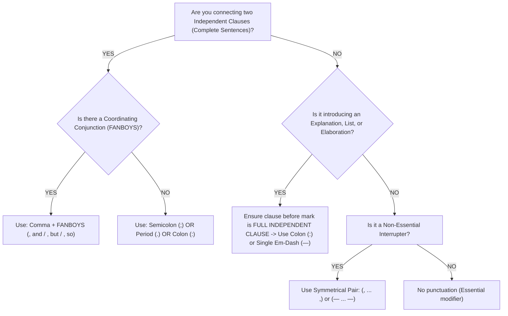

# 🏛️ Digital SAT Reading & Writing: Distractor Trap Radar & Strategy Guide

## 📌 Executive Summary
The Digital SAT Reading & Writing section does not merely test comprehension—it tests your ability to **detect engineered psychological traps**. Every incorrect answer choice is intentionally built using one of **8 proven distractor archetypes**. This cheat sheet provides an actionable recognition radar and decision trees for maximum accuracy on test day.

---

## 🎯 The 8 Fatal Distractor Archetypes

```
┌─────────────────────────────────────────────────────────────┐
│                 THE 8 SAT DISTRACTOR TRAPS                  │
├───────────────────────────────┬─────────────────────────────┤
│ 1. The Opposite Claim (Inverted)│ 5. The Half-Right Trap      │
│ 2. The Verbatim Word Match Trap│ 6. Out of Scope / Speculative│
│ 3. Extreme Language Trap       │ 7. Faulty Comparison Trap   │
│ 4. True-in-Reality (Not in Text)│ 8. Syntactic Modifier Misalignment │
└───────────────────────────────┴─────────────────────────────┘
```

### 1. The Opposite Claim (Inverted Direction)
- **The Trap**: The option directly contradicts the passage's primary claim, often reversing causes and effects (e.g., stating a chemical *inhibits* a reaction when the text says it *catalyzes* it).
- **How to Avoid**: Underline key direction words (*diminish, exacerbate, accelerate, mitigate, undermine*).

### 2. The Verbatim Word Match Trap (The "Copy-Paste" Illusion)
- **The Trap**: The choice uses exact, highly memorable keywords copied directly from the text, but reassembles them to make an unsupportable assertion.
- **How to Avoid**: Never pick an option solely because it shares vocabulary with the passage. Correct answers almost always **paraphrase** ideas using different lexical forms.

### 3. The Extreme Language Trap
- **The Trap**: Uses categorical, dogmatic qualifiers that the text's academic tone never asserted: *always, never, all, completely, solely, impossible, exclusive, proven beyond all doubt*.
- **How to Avoid**: Academic authors almost always *hedge* (*suggest, tend to, in many cases, under certain conditions*). Match the certainty level of the text.

### 4. True-in-Reality, But Unsupported by the Text
- **The Trap**: A statement that is scientifically or historically factual in real life, but is **never mentioned or supported by the stimulus passage**.
- **How to Avoid**: Treat the stimulus as your entire universe. If the text does not supply the direct premise, the choice is wrong.

### 5. The Half-Right Trap
- **The Trap**: The first half of the option is 100% accurate and textual, but the second half slips in an unjustified claim or incorrect consequence.
- **How to Avoid**: Read every answer choice **all the way to the final period**. A single false word invalidates the entire choice.

### 6. Out of Scope / Speculative Extrapolation
- **The Trap**: Takes a moderate premise and leaps two logical steps too far into future implications or unrelated domains.
- **How to Avoid**: On Inference questions, choose the **most conservative, direct next step**.

### 7. Faulty Comparison Trap
- **The Trap**: Compares two entities from the passage (e.g., *"Group A was more productive than Group B"*), when the passage only discussed Group A without evaluating Group B.
- **How to Avoid**: Check if both sides of the comparison are explicitly contrasted in the text.

### 8. Syntactic Modifier Misalignment
- **The Trap**: In Standard English Conventions, the introductory participial phrase is followed by an incorrect noun (e.g., *"Having published her research, the laboratory awarded Dr. Lee..."* $\rightarrow$ the laboratory did not publish the research; Dr. Lee did).
- **How to Avoid**: Identify who or what performs the action of the introductory modifier; that noun MUST immediately follow the comma.

---

## 🚦 Standard English Conventions: Punctuation Decision Tree



---

## 🧭 Expression of Ideas: The 4 Transition Categories

When choosing transition words, classify the relationship before looking at choices:

| Category | Function | High-Yield Transitions |
| :--- | :--- | :--- |
| **Addition / Continuation** | Adds supporting information in the same direction. | *Furthermore, Moreover, In addition, Additionally, Likewise, Similarly* |
| **Contrast / Reversal** | Reverses direction, introduces qualification or exception. | *However, Conversely, Nevertheless, In contrast, On the other hand, Despite this* |
| **Cause & Effect** | Demonstrates logical result or consequence. | *Therefore, Consequently, As a result, Thus, Accordingly, Hence* |
| **Exemplification / Restatement** | Provides concrete evidence or clarifies prior sentence. | *Specifically, For example, For instance, In other words, That is, In particular* |

> [!TIP]
> **Elimination Rule of Thumb**: If two answer choices belong to the exact same transition category (e.g., *A) Furthermore* and *B) Moreover*), **both are almost certainly wrong** because neither is uniquely superior.

---
## New System Alignment (Updated)
**Flow:** Teach → Show → Test
- **Teach:** Detailed strategy and rules (this file)
- **Show:** Walkthrough solving examples — [SAT/Show/show_walkthrough.html](../Show/show_walkthrough.html)
- **Test:** Real SAT difficulty mock — [SAT/Test/mock_01.html](../Test/mock_01.html)
- **Portal:** [SAT/index.html](../index.html) (interactive pen / highlight / mark tools)
---
